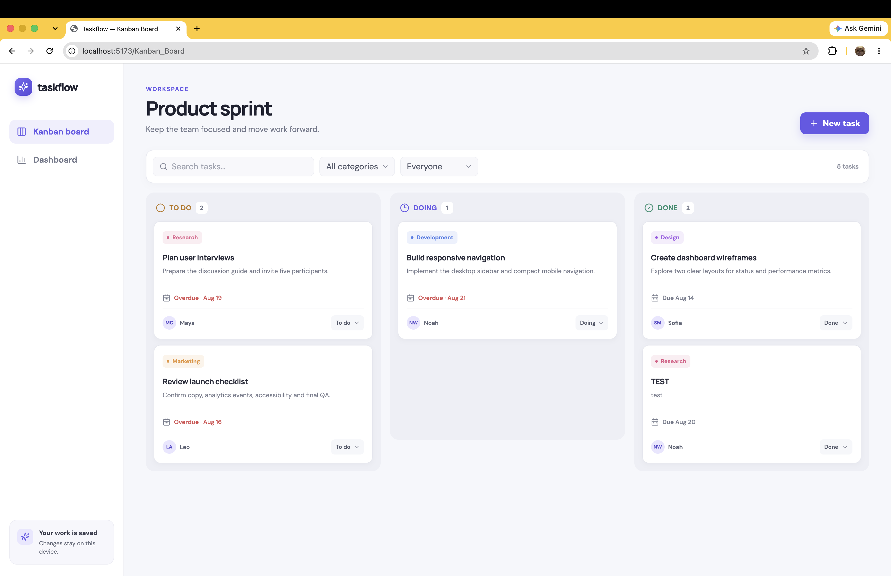
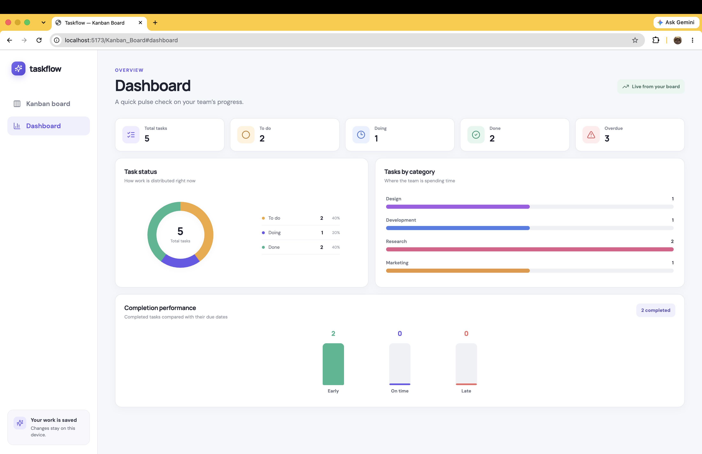

# Taskflow Kanban Board

Taskflow is a browser-based task management application for organizing team work across **To Do**, **Doing**, and **Done**. It includes a visual Kanban board and an analytics dashboard. Tasks and custom categories are saved in the browser's Local Storage, so the app requires no backend.

## Live project

- GitHub repository: `Add repository URL before submission`
- GitHub Pages: `Add GitHub Pages URL before submission`

## Screenshots

1. Kanban board



2. Dashboard



## Features

- Create, edit, and delete tasks
- Move tasks using drag-and-drop or the status dropdown on each card
- Automatically set the completion date when a task moves to Done
- Assign a responsible person and category to every task
- Add reusable custom categories while creating or editing a task
- Set start, due, and completion dates with validation
- Search tasks and filter by category or responsible person
- Persist tasks and categories with Local Storage
- View total, To Do, Doing, Done, and overdue summary cards
- View status, category, and completion-performance charts
- Use the app on desktop, tablet, and mobile layouts

## Team members

- SEIN TUN TUCK -
- SENG BAN NU -
- MIN HTET - 

## Basic usage

1. Select **New task** on the Kanban board.
2. Enter the task details, choose a category and responsible person, then select **Create task**.
3. Drag a task to another column, or use the dropdown at the bottom of its card, to update its status.
4. Use the edit and delete icons at the top-right of a task card to change or remove it.
5. Select **Dashboard** in the navigation to view live task summaries and charts.
6. Refresh the page at any time. Saved tasks and categories remain available on the same browser and device.

## Run locally

Requirements: Node.js 20 or newer and npm.

```bash
npm install
npm run dev
```

Open the local URL printed in the terminal, usually `http://localhost:5173`.

Other useful commands:

```bash
npm run lint
npm run build
npm run preview
```

## Responsible-person data

The assignment brief says the instructor will provide the responsible-person list. The temporary fixed list is in `src/data.js` under `PEOPLE`. Replace those objects with the supplied IDs and names; no other code changes are required.

## Data persistence

The application writes JSON data to these Local Storage keys:

- `taskflow.tasks.v1`
- `taskflow.categories.v1`

Clearing browser site data removes the saved tasks and categories. On first use, the app adds sample tasks so the board and dashboard can be explored immediately.

## Deploy to GitHub Pages

This repository includes `.github/workflows/deploy.yml`.

1. Push the project to a GitHub repository using the `main` branch.
2. In the repository, open **Settings → Pages**.
3. Under **Build and deployment**, select **GitHub Actions** as the source.
4. Push to `main` or manually run the **Deploy to GitHub Pages** workflow.
5. Add the resulting repository and Pages URLs to the **Live project** section above.

## Technology

- React 19
- Vite
- CSS
- Lucide React icons
- Browser Local Storage

